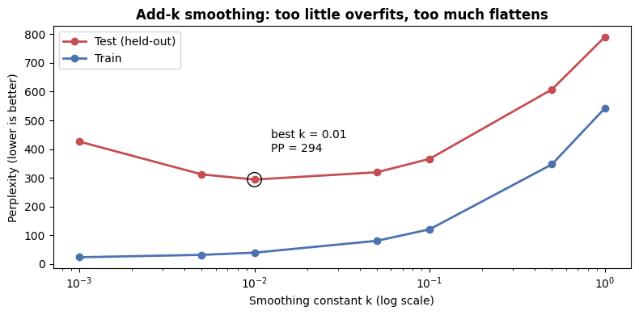
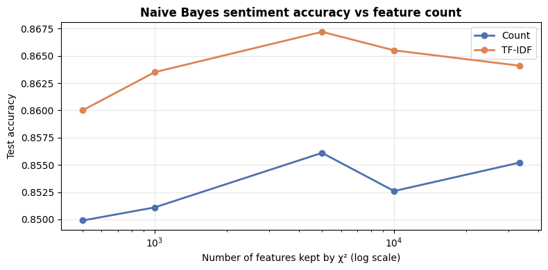
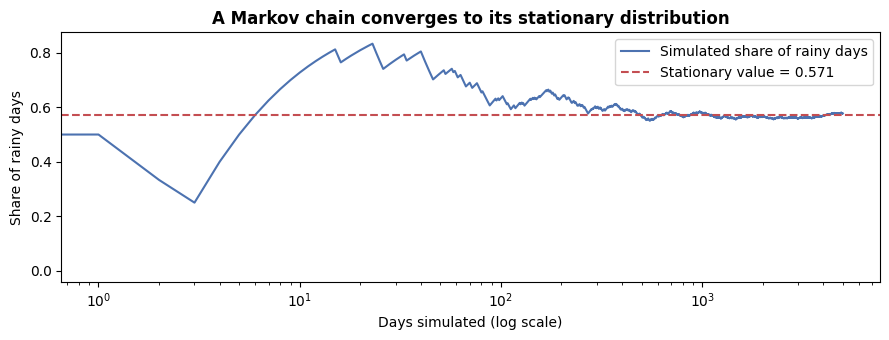
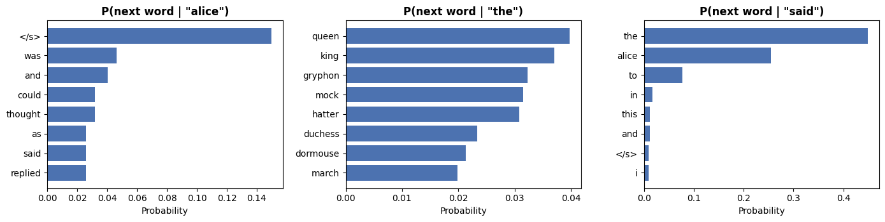
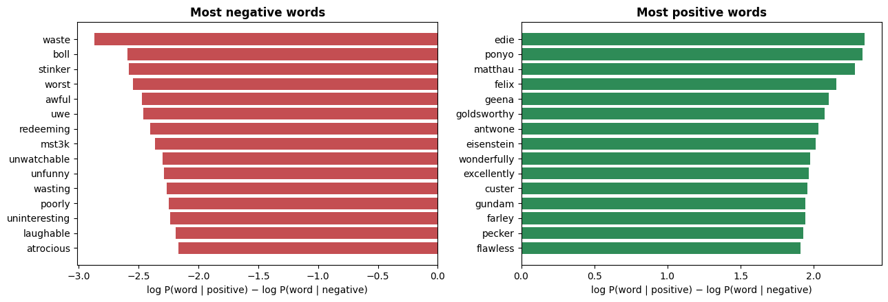

# 🔗 Markov Models & Text Classification with Naive Bayes

[](https://colab.research.google.com/github/MMujtabaX/Markov-Models-Text-Classification/blob/main/Markov_Models_and_Text_Classification.ipynb)


Two classic probabilistic NLP tools, built and evaluated from the ground up: **Markov models** that *generate* text, and **Naive Bayes** classifiers that *label* it. The notebook covers Markov chains and stationary distributions, a bigram language model trained on *Alice in Wonderland*, smoothing and perplexity, topic classification on 20 Newsgroups, and sentiment analysis with feature selection on 50,000 IMDB reviews.

<p align="center">
  
  
</p>

## 📚 Contents

| # | Section | Highlights |
|---|---------|------------|
| 1 | Markov chains | Weather model, simulation, stationary distribution (simulated and via eigenvector) |
| 2 | Bigram language model | A Markov chain over words; next-word distributions; text generation |
| 3 | Smoothing & perplexity | The zero-probability problem, Laplace and add-k smoothing, tuning k on held-out data |
| 4 | Topic classification | Multinomial Naive Bayes on 20 Newsgroups |
| 5 | Sentiment classification | Count vs TF-IDF, χ² feature selection, informative words, failure cases |

## 1️⃣ Markov Chains

The next state depends **only on the current state**. A two-state weather model (Rainy → Rainy 0.7, Sunny → Sunny 0.6) converges to a fixed long-run distribution, whatever state it starts in:

<p align="center">
  
</p>

The exact stationary distribution, found as the left eigenvector of the transition matrix for eigenvalue 1, is **57.1% rainy**. A 5,000-day simulation lands at 57.7%.

## 2️⃣ Bigram Language Model

Treating words as states turns a Markov chain into a language model: $P(w_i \mid w_{i-1})$. Trained on *Alice's Adventures in Wonderland* (1,462 training sentences, 2,483-word vocabulary):

<p align="center">
  
</p>

**Generated sentences:**
> *said alice shall be more than nine the queen's absence and they can't be like being broken to say creatures*
>
> *then they looked under its nest*

Each word pair is plausible, but the sentences don't hang together, because the model only ever looks **one word back**.

## 3️⃣ Smoothing & Perplexity

**40.5% of bigrams in held-out text never appear in training.** Without smoothing, each of those gets probability 0, so the whole test set does too.

| Smoothing | Train perplexity | Test perplexity |
|-----------|------------------|-----------------|
| None (MLE) | 20.2 | **∞** |
| Laplace (add-1) | 541.5 | 789.6 |
| add-0.1 | 120.8 | 366.0 |
| **add-0.01** | 39.6 | **294.0** ✅ |
| add-0.001 | 23.8 | 426.2 |

- **Laplace (add-1) is far too aggressive** for a 2,483-word vocabulary. It hands most of the probability mass to bigrams that never occur.
- **Too little smoothing overfits:** train perplexity keeps falling while test perplexity rises.
- The best held-out perplexity comes from **k = 0.01**, a bias–variance trade-off tuned on held-out data.

## 4️⃣ Topic Classification: 20 Newsgroups

Multinomial Naive Bayes on raw word counts reaches **85.8% accuracy across 20 topics**.

Errors cluster where vocabularies overlap. `comp.os.ms-windows.misc` has only **0.16 recall**, because its posts get absorbed by the other computer groups, and `talk.religion.misc` (0.58 recall) gets confused with the other religion groups. Topics with distinctive vocabulary (hockey, baseball, medicine, space) score **0.94–0.96 F1**.

## 5️⃣ Sentiment Classification: 50,000 IMDB Reviews

Count vs TF-IDF features, combined with keeping the top-*k* words ranked by the **Chi-squared test**:

| χ² features kept | Count | TF-IDF |
|------------------|-------|--------|
| 500 | 0.850 | 0.860 |
| 1,000 | 0.851 | 0.864 |
| **5,000** | 0.856 | **0.867** ✅ |
| 10,000 | 0.853 | 0.866 |
| All 33,325 | 0.855 | 0.864 |

- **TF-IDF beats raw counts at every feature budget.**
- **5,000 well-chosen words beat all 33K.** The extra words mostly add noise.
- Even **500 words reach 86%**: sentiment information is concentrated in a small vocabulary.

<p align="center">
  
</p>

The negative words read like a sentiment dictionary (*waste*, *worst*, *unwatchable*), plus *uwe* and *boll*, for director **Uwe Boll**, and *mst3k*. The positive side is dominated by **names** (*edie*, *ponyo*, *matthau*): actors and films that only appear in glowing reviews. That's a sign the model partly memorizes *which movies people liked* rather than *how people express liking*.

**A failure case worth understanding:**

| Review | P(positive) |
|--------|-------------|
| "An absolute masterpiece. The acting was superb..." | 0.88 ✅ |
| "A complete waste of two hours..." | 0.04 ✅ |
| "I expected it to be **terrible**, but it turned out to be surprisingly **brilliant**." | **0.49** ❌ |

Naive Bayes treats "terrible" and "brilliant" as independent clues and can't see that *"but"* reverses the meaning. Capturing that requires models of word order and context.

## 💡 Key Takeaways

- Markov models and Naive Bayes are both built on **counting and conditional probability**, and both need **smoothing** to handle unseen events.
- **Perplexity** gives an objective way to compare and tune language models.
- **Feature engineering and selection matter**, even for a simple classifier.
- Both approaches **ignore long-range context**, which motivates word embeddings, RNNs and transformers.

## 🚀 Run It

Click the **Open in Colab** badge above and choose **Runtime → Run all**. Every dataset downloads automatically: the Gutenberg corpus via NLTK, 20 Newsgroups via scikit-learn, and IMDB from a public CSV. The full run takes about 3–5 minutes.

```bash
pip install nltk scikit-learn pandas numpy matplotlib
```

## 🙏 Acknowledgements

Based on NLP course material (Lecture 3); implementation, experiments and analysis completed and extended by me.

## 👤 Author

**Muhammad Mujtaba Khan Suri** — CS @ UBIT, University of Karachi
[GitHub](https://github.com/MMujtabaX)
